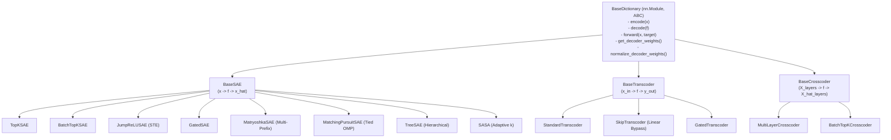

# AGENTS.md — Developer & AI Agent Operations Manual

Welcome to **Interpret Playground**. This document defines the engineering standards, architecture design patterns, testing conventions, and execution workflows for human developers and autonomous AI agents working in this repository.

---

## 1. System Environment & Tooling

- **Conda Environment**: `sae_circuit`
- **Python Binary**: `/home/vaipe/.conda/envs/sae_circuit/bin/python`
- **Hardware Profile**: NVIDIA GeForce RTX 4090 (24GB VRAM) + PyTorch 2.6 with CUDA 12.4
- **Running Tests**:
  ```bash
  /home/vaipe/.conda/envs/sae_circuit/bin/python -m pytest tests/ -v
  ```
- **Dependencies Management**: PyTorch 2.6+, Transformers 4.40+, Datasets, SafeTensors, Pydantic 2, Rich, Einops, FlashAttention/SDPA.

---

## 2. Architecture Design & Registry Pattern

All dictionary representations inherit from [`BaseDictionary`](file:///mnt/disk4/pquan/Interpret/src/core/base_dictionary.py) and are registered dynamically in [`src/architectures/registry.py`](file:///mnt/disk4/pquan/Interpret/src/architectures/registry.py).

### Hierarchy:


### How to Add a New Architecture:
1. Create a new subclass inheriting from `BaseSAE`, `BaseTranscoder`, or `BaseCrosscoder`.
2. Decorate with `@register_dictionary("your_arch_name")`.
3. Implement `encode()`, `decode()`, `get_decoder_weights()`, and `forward()`.
4. Export the class in the relevant `__init__.py`.
5. Add a test case to `tests/test_architectures.py`.

---

## 3. Universal Model Hooking & Activation Extraction

### Submodule Resolution ([`src/core/hook_manager.py`](file:///mnt/disk4/pquan/Interpret/src/core/hook_manager.py)):
- **Residual Stream**: e.g., `"transformer.7"`, `"model.layers.12"`, `"transformer.h.6"`
- **MLP Sublayer**: e.g., `"transformer.7.ffn2"`, `"model.layers.12.mlp"`, `"transformer.h.6.mlp"`
- **Attention Output**: e.g., `"transformer.7.attn.out_proj"`, `"model.layers.12.self_attn.o_proj"`

### Universal Model Loader ([`src/utils/hf_helpers.py`](file:///mnt/disk4/pquan/Interpret/src/utils/hf_helpers.py)):
- Supports standard Hugging Face models (Gemma 3, LLaMA 3, Qwen 2.5, GPT-2).
- Automatic `attn_implementation="sdpa"` for FlashAttention memory savings.
- Support for `load_in_4bit=True` and `load_in_8bit=True` for VRAM-constrained setups.
- Standalone custom architectures (e.g. PlanckGPT) are automatically resolved without custom mode flags.
- Auto-extracts unembedding matrix $W_U$ across all architectures for **Direct Logit Attribution (Logit Lens)**.

---

## 4. Configuration System (`configs/`)

All experiment configurations are **self-contained single YAML files** in [`configs/`](file:///mnt/disk4/pquan/Interpret/configs/):

```
configs/
├── gemma3_270m_all_layers.yaml    # Gemma 3 270M (All 18 Depth Layers Simultaneously)
├── gemma3_270m_single_layer.yaml  # Gemma 3 270M (Single Layer 9)
├── planckgpt_batch_topk.yaml      # PlanckGPT BatchTopK SAE
├── gpt2_topk.yaml                 # GPT-2 TopK SAE
├── skip_transcoder.yaml           # Skip-Transcoder
├── crosscoder.yaml                # Multi-Layer Crosscoder
├── auto_interp.yaml               # 100% Local Auto-Interpretation
└── circuits.yaml                  # Edge Attribution Patching (EAP-SAE) & Transcoder Graphs
```

---

## 5. Critical Engineering Principles & Coding Standards

1. **Object-Oriented Invariants & DRY Encoding**:
   - **Single Source of Truth**: `encode()` and `decode()` MUST be the sole locations defining feature activation and signal reconstruction.
   - In `forward()`, always invoke `f, pre_acts = self.encode(x, return_pre_acts=True)` and `x_hat = self.decode(f)`. Never duplicate linear projections or Top-K/gating routines in `forward()`.
   - **Standardized Method Ordering**: Every architecture class MUST maintain the uniform method order:
     `__init__()` $\to$ `_reset_parameters()` $\to$ `get_decoder_weights()` $\to$ `encode()` $\to$ `decode()` $\to$ `forward()`.
   - **Zero Unnecessary `getattr`/`hasattr` Spam**: Rely on typed interfaces and explicit abstract class properties.

2. **Paper-Specific Dead Latent Paradigms (No One-Size-Fits-All)**:
   - **OpenAI TopK / BatchTopK**: Native $\mathcal{L}_{\text{aux}} = \frac{1}{32} \|(x - \hat{x}) - W_{\text{dec}} f_{\text{dead}}\|_2^2$ with continuous **softplus gradient flow** on dead features ($\sigma(z) > 0$).
   - **DeepMind JumpReLU**: Gaussian-kernel Straight-Through Estimator (STE) on learnable threshold $\theta$.
   - **DeepMind Gated**: Auxiliary gating loss $\text{MSE}(x, \hat{x}_{\text{gate}})$ using `W_dec.detach()`.
   - **Hierarchical TreeSAE**: Multi-scale coarse branch auxiliary reconstruction loss $\mathcal{L} = \text{MSE}_{\text{fine}} + 0.25 \text{MSE}_{\text{coarse}}$.
   - **SASA**: Dataset-level budget penalty $\mathcal{L}_{\text{budget}} = \left(\frac{\bar{k}(x) - k_{\text{target}}}{k_{\text{target}}}\right)^2$.
   - **Anthropic Ghost Gradients**: Universal trainer-level safety net operating on unclamped raw `pre_acts`.

3. **VRAM Optimization & Gradient Hygiene (GPU)**:
   - Always run base model forward passes under `torch.amp.autocast('cuda', dtype=torch.bfloat16)` with `@torch.no_grad()`.
   - Immediate per-layer backward passes in multi-layer training to free autograd activation memory instantly.
   - Use in-place operations (`tensor.div_()`, `tensor.scatter_()`) for unit-norm decoder weight projection.

4. **Contiguous Memory Layout**:
   - Always ensure tensors are `.contiguous()` after boolean masking, slicing, or transposition before calling `.view()`, matrix multiplications, or `safetensors.save_file()`.

5. **Scale-Invariant Normalized Tracking**:
   - Track and log scale-invariant mean loss across layers (`loss/total = total_loss_accum / max(1, num_layers)`) and **Normalized MSE ($\text{NMSE} = \frac{\|x - \hat{x}\|_2^2}{\text{Var}(x)}$)**. Never report scale-dependent sum metrics.

6. **Zero External API Dependency**:
   - All auto-interpretation runs locally using quantized instruct models (e.g. `google/gemma-3-4b-it` in 4-bit) without remote API keys.

---

## 6. Verification & Test Suite

Before committing code or submitting changes, always run the full static analysis and test suite:

```bash
pyflakes src/ scripts/ tests/
python -m pytest tests/ -v
```

Current test suite contains **23 automated tests** covering:
- Forward/backward passes and unit-norm constraints for all 11 architectures.
- Transcoder and Crosscoder multi-layer flows.
- SafeTensors save/load round-tripping.
- Direct Logit Attribution (Logit Lens).
- Explanation simulation scoring.
- Edge Attribution Patching (EAP-SAE) autograd gradient flows.
- Transcoder causal replacement graphs.
- End-to-end multi-layer GPU training, checkpointing, and steering pipeline.

<!-- CODEGRAPH_START -->
## CodeGraph

In repositories indexed by CodeGraph (a `.codegraph/` directory exists at the repo root), reach for it BEFORE grep/find or reading files when you need to understand or locate code:

- **MCP tool** (when available): `codegraph_explore` answers most code questions in one call — the relevant symbols' verbatim source plus the call paths between them, including dynamic-dispatch hops grep can't follow. Name a file or symbol in the query to read its current line-numbered source. If it's listed but deferred, load it by name via tool search.
- **Shell** (always works): `codegraph explore "<symbol names or question>"` prints the same output.

If there is no `.codegraph/` directory, skip CodeGraph entirely — indexing is the user's decision.
<!-- CODEGRAPH_END -->

