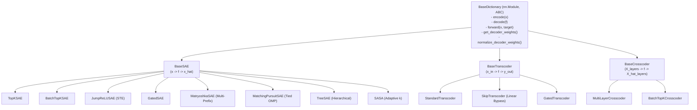

# AGENTS.md — Developer & AI Agent Operations Manual

Welcome to **Interpret Playground**. This document defines the engineering standards, architecture design patterns, testing conventions, and execution workflows for human developers and autonomous AI agents working in this repository.

---

## 1. System Environment & Tooling

- **Conda Environment**: `sae_circuit`
- **Python Binary**: `/home/vaipe/.conda/envs/sae_circuit/bin/python`
- **Hardware Profile**: NVIDIA GeForce RTX 4090 (24GB VRAM) + PyTorch 2.6 with CUDA 12.4
- **Running Tests**:
  ```bash
  /home/vaipe/.conda/envs/sae_circuit/bin/python -m pytest tests/ -v
  ```
- **Dependencies Management**: PyTorch 2.6+, Transformers 4.40+, Datasets, SafeTensors, Pydantic 2, Rich, Einops, FlashAttention/SDPA.

---

## 2. Architecture Design & Registry Pattern

All dictionary representations inherit from [`BaseDictionary`](file:///mnt/disk4/pquan/Interpret/src/core/base_dictionary.py) and are registered dynamically in [`src/architectures/registry.py`](file:///mnt/disk4/pquan/Interpret/src/architectures/registry.py).

### Hierarchy:


### How to Add a New Architecture:
1. Create a new subclass inheriting from `BaseSAE`, `BaseTranscoder`, or `BaseCrosscoder`.
2. Decorate with `@register_dictionary("your_arch_name")`.
3. Implement `encode()`, `decode()`, `get_decoder_weights()`, and `forward()`.
4. Export the class in the relevant `__init__.py`.
5. Add a test case to `tests/test_architectures.py`.

---

## 3. Universal Model Hooking & Activation Extraction

### Submodule Resolution ([`src/core/hook_manager.py`](file:///mnt/disk4/pquan/Interpret/src/core/hook_manager.py)):
- **Residual Stream**: e.g., `"transformer.7"`, `"model.layers.12"`, `"transformer.h.6"`
- **MLP Sublayer**: e.g., `"transformer.7.ffn2"`, `"model.layers.12.mlp"`, `"transformer.h.6.mlp"`
- **Attention Output**: e.g., `"transformer.7.attn.out_proj"`, `"model.layers.12.self_attn.o_proj"`

### Universal Model Loader ([`src/utils/hf_helpers.py`](file:///mnt/disk4/pquan/Interpret/src/utils/hf_helpers.py)):
- Supports standard Hugging Face models (Gemma 3, LLaMA 3, Qwen 2.5, GPT-2).
- Automatic `attn_implementation="sdpa"` for FlashAttention memory savings.
- Support for `load_in_4bit=True` and `load_in_8bit=True` for VRAM-constrained setups.
- Standalone custom architectures (e.g. PlanckGPT) are automatically resolved without custom mode flags.
- Auto-extracts unembedding matrix $W_U$ across all architectures for **Direct Logit Attribution (Logit Lens)**.

---

## 4. Configuration System (`configs/`)

All experiment configurations are **self-contained single YAML files** in [`configs/`](file:///mnt/disk4/pquan/Interpret/configs/):

```
configs/
├── gemma3_270m_batch_topk.yaml  # Gemma 3 270M BatchTopK SAE
├── gemma3_270m_topk.yaml        # Gemma 3 270M TopK SAE
├── planckgpt_batch_topk.yaml    # PlanckGPT BatchTopK SAE
├── planckgpt_topk.yaml          # PlanckGPT TopK SAE
├── gpt2_topk.yaml               # GPT-2 TopK SAE
├── skip_transcoder.yaml         # Skip-Transcoder
├── crosscoder.yaml              # Multi-Layer Crosscoder
├── auto_interp.yaml             # 100% Local Auto-Interpretation
└── circuits.yaml                # Edge Attribution Patching (EAP-SAE)
```

---

## 5. Critical Engineering Principles & Coding Standards

1. **VRAM Optimization (GPU)**:
   - Always run base model forward passes under `torch.amp.autocast('cuda', dtype=torch.bfloat16)` with `@torch.no_grad()`.
   - Use in-place operations (`tensor.div_()`, `tensor.scatter_()`) for weight normalization.
2. **Contiguous Memory Layout**:
   - Always ensure tensors are `.contiguous()` after boolean masking, slicing, or transposition before calling `.view()`, matrix multiplications, or `safetensors.save_file()`.
3. **Host RAM Optimization**:
   - Streaming buffers write directly into pre-allocated memory slices; never accumulate unbounded Python lists of tensors.
4. **Data Faithfulness (Anti-Artifacts)**:
   - **BOS Attention Sink Filtering**: Always mask token 0 (`mask[:, 0] = False`) in `ActivationBuffer` to avoid attention sink distortion.
   - **Online Activation Normalization**: Running mean centering and norm scaling $s = \frac{\sqrt{d}}{\mathbb{E}[\|x - \mu\|_2]}$.
5. **Zero External API Dependency**:
   - All auto-interpretation runs locally using quantized instruct models (e.g. `google/gemma-3-4b-it` in 4-bit) without remote API keys.
6. **Structured Logging & WandB**:
   - Use `src.utils.logging.setup_logger` for clean, formatted console logging.
   - Log all losses (`loss/total`, `loss/mse`, `loss/ghost_grads`) and health metrics (`metrics/l0`, `metrics/dead_pct`, `metrics/tokens_processed`) to WandB.

---

## 6. Verification & Test Suite

Before committing code or submitting changes, always run the full test suite:

```bash
python -m pytest tests/ -v
```

Current test suite contains **20 automated tests** covering:
- Forward/backward passes and unit-norm constraints for all 11 architectures.
- Transcoder and Crosscoder multi-layer flows.
- SafeTensors save/load round-tripping.
- Direct Logit Attribution (Logit Lens).
- Explanation simulation scoring.
- Edge Attribution Patching (EAP-SAE) autograd gradient flows.
- End-to-end GPU training, checkpointing, and steering pipeline.
